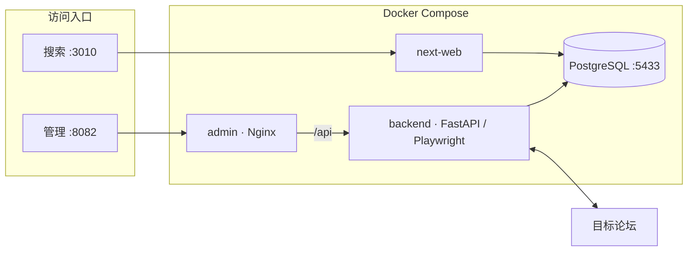

# sehua

家庭 NAS 上的 **论坛资源采集与检索全栈**：爬虫入库 · 管理运维 · 全文搜索，一套 Compose 跑通。

[](./VERSION)
[](#技术栈)
[](#nas-部署)
[](#声明)

镜像由 GitHub Actions 构建并推送 **Docker Hub**（及 GHCR）；NAS **只 pull，不本地 build**。发版递增叠加（`1.0.1` … `1.0.17`），历史标签保留，`latest` 始终指向当前版。

---

## 一眼看懂



| 组件 | 职责 | 生产端口 |
|------|------|----------|
| **backend** | 列表扫帖 · 详情解析 · 入库 · 重爬 · 资源库备份 | 不对外（经 admin 反代） |
| **admin** | 鉴权、爬虫拓扑、论坛配置、导入与数据管理 | **8082** |
| **next-web** | 搜索 / 浏览 / 详情；可选 115 转存与云解压 | **3010** |
| **PostgreSQL 16** | 资源、来源元数据、爬虫队列、鉴权 | **5433** |

---

## 能力

| | |
|--|--|
| **智能爬取** | 按板块-分类子版（fid:typeid）深扫；每日首页捕新，当日后续轮次只深扫；子版游标续爬至板底后切下一启用板 |
| **结构入库** | 磁力 / ED2K 解析；按板块白名单整理名称、类型、大小、密码等字段；预览图与来源溯源 |
| **运维闭环** | 连续调度 / 扫新帖 / 随机抓帖 / 账号爬占位；异常重试；单份滚动 SQL 备份 |
| **检索体验** | Next.js 搜看一体；详情密码一键复制；115 VIP 转存后轮询并云解压（保留压缩包） |

**刻意不做**：Telegram 监听、NAS 现场编译业务镜像、管理端原生 App。

---

## 技术栈

| 层 | 选型 |
|----|------|
| API / 爬虫 | Python · FastAPI · Playwright · httpx |
| 管理端 | Vite · React · Nginx |
| 搜索端 | Next.js · GraphQL · 直连 Postgres |
| 数据 | PostgreSQL 16 · SQL 迁移（`database/migrations/`） |
| 交付 | multi-arch 镜像 · Compose · GitHub Actions |

---

## Docker 镜像

### Docker Hub（推荐）

| 服务 | 镜像 |
|------|------|
| 后端 | [`poillysky/sehuatang-backend:1.0.17`](https://hub.docker.com/r/poillysky/sehuatang-backend) |
| 管理 | [`poillysky/sehuatang-admin:1.0.17`](https://hub.docker.com/r/poillysky/sehuatang-admin) |
| 搜索 | [`poillysky/sehuatang-search:1.0.17`](https://hub.docker.com/r/poillysky/sehuatang-search) |

Hub：[poillysky](https://hub.docker.com/u/poillysky) · 每次发版同时推送版本号与 `latest`。NAS Compose 请钉死版本号，勿盲追未验证的 `latest` 行为变更。

### GHCR（可选）

```text
ghcr.io/poillysky/sehuatang-backend:1.0.17
ghcr.io/poillysky/sehuatang-admin:1.0.17
ghcr.io/poillysky/sehuatang-search:1.0.17
```

CI：[`.github/workflows/docker.yml`](./.github/workflows/docker.yml)

---

## NAS 部署

### 目录约定

```text
/vol1/1000/Docker/sehuatang/
├── docker-compose.nas.yml      # 自仓库 deploy/ 拷贝
├── update.sh                   # 可选一键 pull + up
└── data/
    ├── postgres/               # 库文件（可从旧实例迁入）
    ├── backend/                # Cookie、会话、预览缓存
    ├── backups/                # 资源表单份备份 ed2k-resources.sql.gz
    ├── search/                 # 115 等搜索端配置
    └── search-cache/           # Next 缓存（可丢）
```

### 启动

```bash
cd /vol1/1000/Docker/sehuatang
docker compose -f docker-compose.nas.yml pull
docker compose -f docker-compose.nas.yml up -d
# 或: sh update.sh
```

### 访问

| URL | 用途 |
|-----|------|
| `http://NAS_IP:3010` | 搜索前端 |
| `http://NAS_IP:8082` | 管理后台（`/api` → backend） |
| `NAS_IP:5433` | PostgreSQL（工具直连） |

默认凭据（**上线后立刻修改**）：

- 管理：`admin` / `admin123`（Compose `INITIAL_ADMIN_*`）
- 数据库：见 Compose `POSTGRES_*`

### 迁入旧库（一次性）

停旧栈（勿 `down -v`、勿删数据目录）→ 将旧 Postgres 目录拷至 `data/postgres` → `up -d`。  
细则：[docs/部署.md](./docs/部署.md) · [deploy/README.md](./deploy/README.md)

### 升级

改 Compose 镜像标签至目标版本后：

```bash
docker compose -f docker-compose.nas.yml pull
docker compose -f docker-compose.nas.yml up -d
```

---

## 爬虫策略（摘要）

- 列表统一按 **发帖时间** 排序。
- **每天一次**首页捕新：翻到「整页已入库」即停；**当日后续循环只深扫**，不再读第 1 页。
- 深扫按板块游标续爬（结束页重叠 1 页）；连续全已知可早停。
- 需满龄板块：未满龄延期入队，到期再抓。
- 待抓积压过大时优先消化队列，暂缓读列表。
- 游客 Cookie 与 **账号 Cookie** 隔离；账号会话仅用于「账号爬占位」。

配置入口：管理端 → 论坛 / 爬虫。

---

## 仓库结构

```text
sehuatang/
├── backend/              # FastAPI：爬虫 · 入库 · 管理 API
├── frontend/admin/       # 管理端（Vite + React → Nginx）
├── next-web/             # 搜索端（Next.js）
├── database/migrations/  # PostgreSQL 迁移
├── deploy/               # NAS Compose（只 pull）
├── docs/                 # 架构 · 设计 · 部署
├── VERSION               # 当前发版号
└── start.bat             # Windows 本地三窗启动
```

---

## 本地开发

Windows 可双击根目录 `start.bat`，或分别启动：

```bash
# 后端 → :8080
cd backend && pip install -r requirements.txt
uvicorn api.main:app --reload --port 8080

# 管理 → :8081（开发）
cd frontend/admin && npm install && npm run dev

# 搜索 → :3010
cd next-web && npm install && npm run dev
```

Backend 启动时自动执行待跑 SQL 迁移。

---

## 数据模型（简）

- **资源**：下载链主体 + 文件名 / 大小 / 检索字段  
- **来源**：标题、结构化描述、预览、论坛 / 板块、入库判定、密码  
- **队列**：待抓 / 已抓帖页与重试状态  
- **鉴权**：管理账号与权限  

管理端支持资源表 **单份覆盖备份**（备份前暂停爬虫，结束后按快照恢复）。

---

## 搜索端 · 115

在搜索站「115 设置」填写 Cookie 与目录。  
带解压密码转存时：轮询离线任务（最长约 **30 秒**），就绪后云解压到同名文件夹，**保留压缩包**（需 VIP）。

---

## 文档

| 文档 | 内容 |
|------|------|
| [docs/架构.md](./docs/架构.md) | 组件职责、数据流、NAS 拓扑 |
| [docs/设计说明.md](./docs/设计说明.md) | 产品边界与取舍 |
| [docs/部署.md](./docs/部署.md) | 部署细则、目录、更新 |
| [deploy/README.md](./deploy/README.md) | Compose 目录约定 |

---

## 发版

仓库：https://github.com/poillysky/sehua

下一版 **1.0.18**：同步改 `VERSION`、`deploy/docker-compose.nas.yml` 镜像标签、workflow `RELEASE_TAG`，提交并打 `v1.0.18`。
Hub / GHCR 保留全部历史版本号；`latest` = 最近一次发版。

---

## 声明

仅供个人学习与局域网自用。请遵守目标站点条款与当地法律法规，勿用于未授权传播或商业用途。
